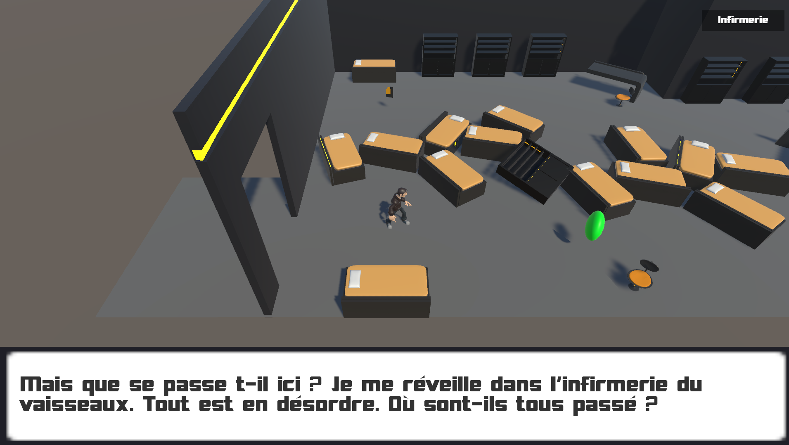
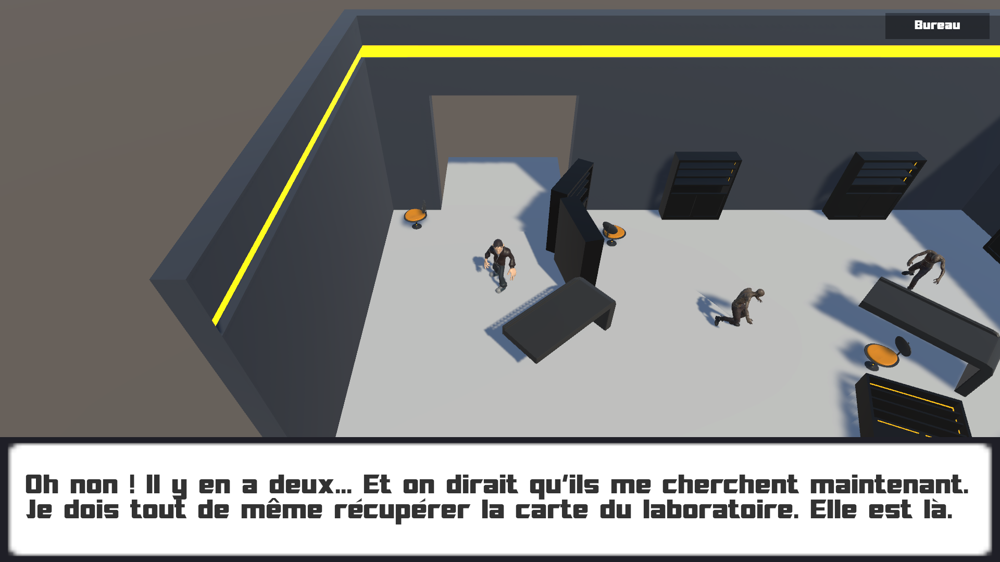
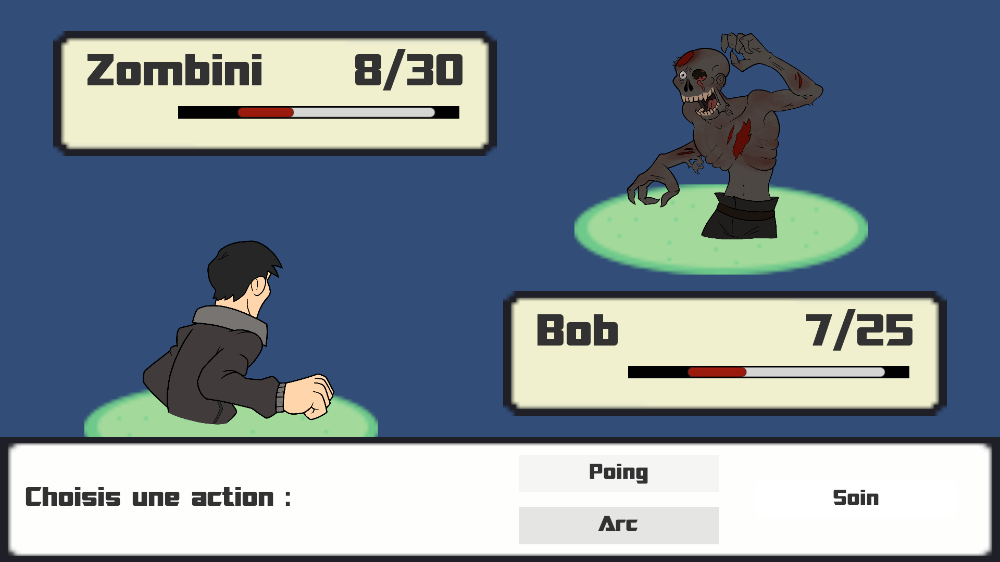

# Projet RPG Silence
Projet effectué dans le cadre d'une unité d'enseignement visant à construire un RPG.

## Pitch
Vous vous réveillez dans un vaisseau spatial désert. 
Vous décidez de mener l’enquête afin de comprendre ce qui s’est passé.

## Screenshot

## Comment jouer
Cliquez sur le sol pour déplacer le personnage.
Touchez ou approchez certains objets pour les récupérer ou interagir avec.
Vous entrez en combat avec un ennemi dès que celui-ci vous touche.

## Démonstration
[Online sur Itch.io](https://ludovic330.itch.io/silence)

## Équipe
[Jade FRATREZ](https://www.linkedin.com/in/fratrez-jade/) :  
modélisation/texturing (environnement, mobilier, props), moodboards, concept art (zombie), scénario, fond d’écran menu principal

[Alexandre PICHONNIER--MARTIN](https://www.linkedin.com/in/alexandre-pichonnier--martin/) :  
modélisation/texturing (joueur), sprites 2D (joueur et zombie), intégration modèle joueur, intégration animations mixamo zombie, création galerie, concept art (protagoniste)

[Ludovic MANTOVANI](https://www.linkedin.com/in/ludovic-mantovani/) :  
programmation, gestion de projet, déplacement personnage, ronde ennemis, combat, caméra, scènes, intégration animations mixamo joueur, UI, menus
